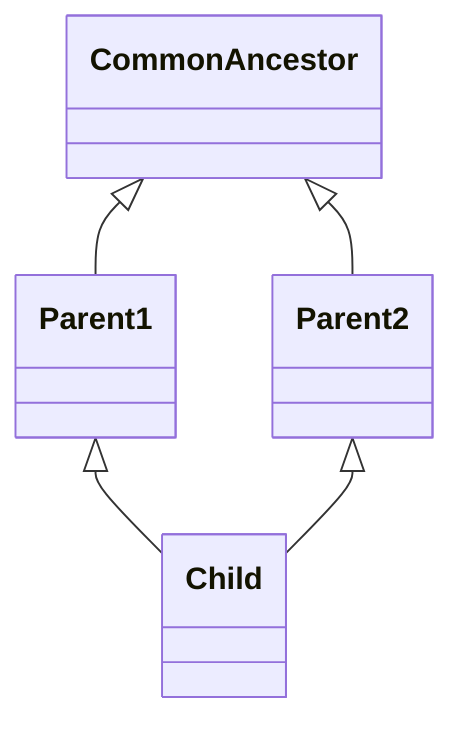

# Seminário de Engenharia de Software

Esse é um seminário da disciplina de Engenharia de Software I, com quatro tópicos: Padrão de Projeto, Anti-Padrão, Code Smell e Técnica de Refatoração. Com os tópico especificos escolhidos sendo: Strategy, Diamante da Morte, Refused Bequest e Extração de Interface, respectivamente. A apresentação está disponível em: https://alan-b-lima.github.io/eng-soft-seminario/dist/slides/home.html.

## Padrão de Projeto: Strategy

Definir uma família de algoritmos, encapsular cada uma, e fazê-los intercambiáveis. Strategy permite que o algoritmo varie de forma independente do cliente que o usa[^four].

### Interfaces Funcionais no Java

Interfaces com um, e apenas um método abstrato são consideradas _interfaces funcionais_. Um exemplo desses é a classe Comparator\<E>:

```java
public interface Comparator<E> {
    int compare(E o1, E o1);
}
```

Para declará-los, a forma tradicional seria criar uma classe a parte que implementa essa interface, ou usar funções anônimas:

```java
Comparator<Integer> func = new Comparator<>() {
    int compare(Integer o1, Integer o2) {
        return o1 - o2;
    }
};

Comparator<Integer> func = (o1, o2) -> {
    return o1 - o2;
};
```

## Anti-Padrão: Diamante da Morte

Diamante da Morte (ou Deadly Diamand of Death), também conhecido como problema de herança múltipla, ocorre quando duas ramificações em uma cadeia hierárquica convergem, o esquema geral é disposto abaixo:



Pense no seguite problema: ""

## Code Smell: Refused Bequest


## Técnica de Refatoração: Extração de Interface


# Referências

[^muratori]: [Casey Muratori - The Big OOPs: Anatomy of a Thirty-five-year Mistake](https://www.youtube.com/watch?v=wo84LFzx5nI)
[^four]: [Gang of Four - Design Patterns: Elements of Reusable Object Oriented Programming](https://www.javier8a.com/itc/bd1/articulo.pdf)